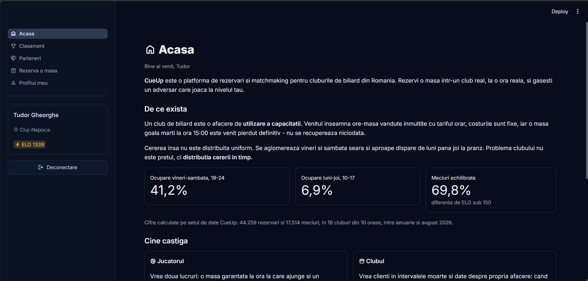
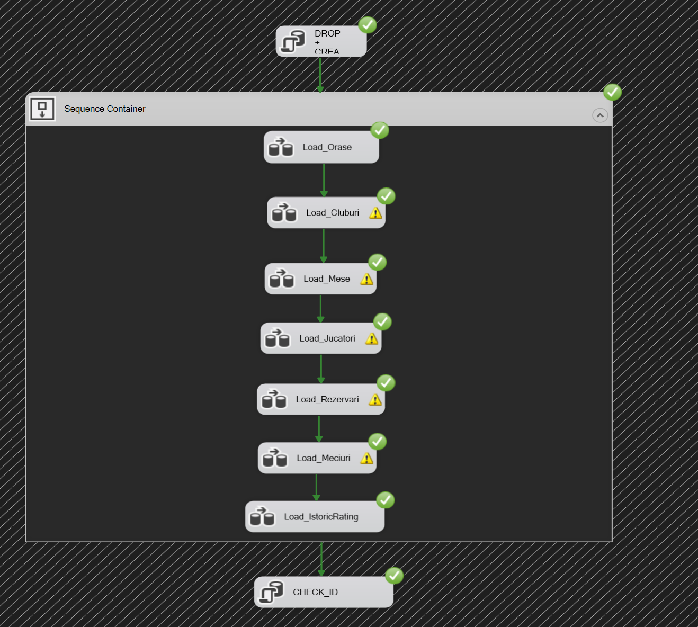
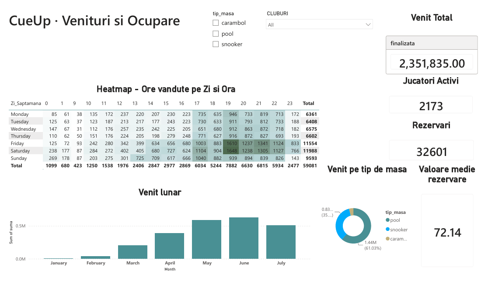
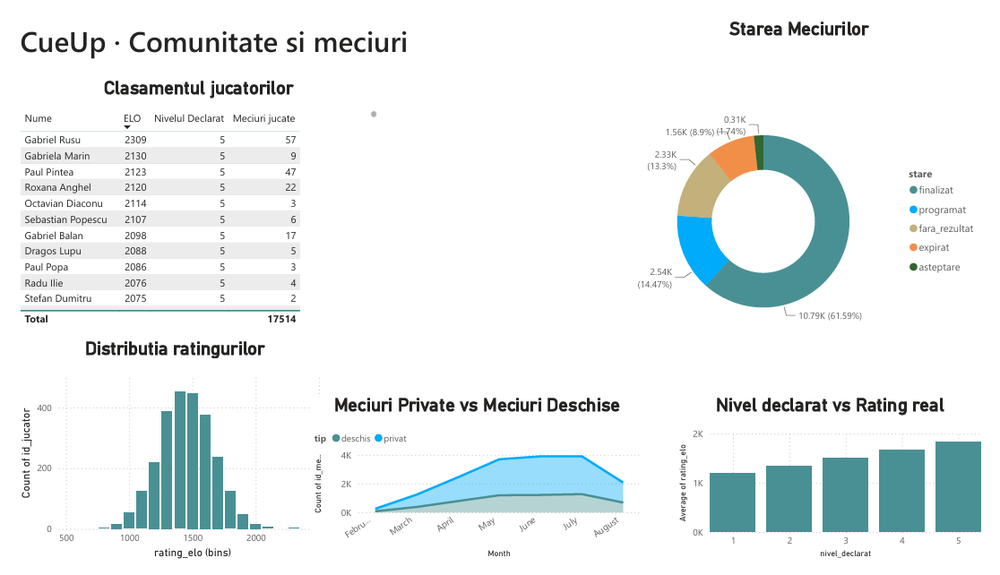

# 🎱 CueUp


> Table booking and matchmaking platform for billiard clubs in Romania.

Book a table at a real club, at a real time slot, and find an opponent who plays at your level. Built during the **Data Journey: From Cloud to AI** summer school, where it won **first prize**.

CueUp covers the full data pipeline: a synthetic dataset generated with AI, loaded through SSIS into an Azure SQL database, then consumed simultaneously by a Streamlit app and two Power BI reports.



## Why it exists

A billiard club doesn't sell tables, it sells **table hours**. Revenue equals hours sold times the hourly rate, while costs stay fixed. An hour left unsold on a Tuesday at 3 PM is never recovered.

The data shows a **53 to 1** ratio between the busiest slot (Saturday 7 PM) and the emptiest one (Wednesday 9 AM). Occupancy runs at 41.2% on Friday and Saturday evenings, against 6.9% Monday through Thursday around noon.

A club's problem isn't pricing, it's how demand is spread across time. That's the gap CueUp fills.

## Features

- **Free table search** by city, club, date and time slot, with overlap detection
- **Matchmaking** based on an ELO rating computed from results, not self-declared
- **Booking** with real-time availability checks
- **Leaderboards**, local and national, showing where you stand
- **AI coach** powered by Gemini, fed with your actual stats from the database
- **Two Power BI reports** covering occupancy, revenue and community health

## Architecture

```
Python script          SSIS              Azure SQL
(Claude Opus 5)   →   7 chained     →    7 tables          ┌→  Streamlit  →  Gemini API
7 CSV files           data flows         9 foreign keys    │
                                         constraints ──────┤
                                                           └→  Power BI
```

| Stage | Technology | Role |
|---|---|---|
| Generation | Python, Claude Opus 5 | Synthetic dataset with realistic demand patterns |
| ETL | SSIS (Visual Studio) | Schema creation plus 7 sequential data flows |
| Storage | Azure SQL Database | 7 tables, 9 foreign keys, `CHECK` constraints |
| Application | Streamlit, `pyodbc` | Web interface, connected straight to the database |
| AI | `google-genai` | Personalised advice built from real player stats |
| Reporting | Power BI Desktop | Two reports over the same relational model |

The app and the reports read from the same database. There are no data copies that could drift apart.

## Project structure

```
CueUp/
├── data/                  The 7 CSV files, source for the ETL
├── ETL_CueUp/             SSIS package (Package.dtsx)
├── Rapoarte/              CueUp_Rapoarte.pbix
├── src/
│   ├── app.py             Streamlit entry point
│   ├── db.py              Connection and every SQL query
│   ├── auth.py            Login and registration
│   ├── gemini_client.py   Gemini API integration
│   ├── ui.py              Shared UI components
│   └── app_pages/         The 6 application pages
└── requirements.txt
```

## Getting started

### Prerequisites

- Python 3.13
- [ODBC Driver 17 for SQL Server](https://learn.microsoft.com/sql/connect/odbc/download-odbc-driver-for-sql-server)
- An Azure SQL database, or a local SQL Server instance
- Visual Studio with the *SQL Server Integration Services Projects* extension, for the ETL part
- Power BI Desktop, for the reports

### 1. Load the data

Open `ETL_CueUp.slnx` in Visual Studio and run the package with **F5**.

The package rebuilds the schema from scratch, loads the 7 tables in the order imposed by the foreign keys, and resynchronises the `IDENTITY` counters. It is idempotent, so it can be run as many times as needed.



Check the result:

```sql
SELECT COUNT(*) FROM dbo.Rezervari;   -- 44259
SELECT COUNT(*) FROM dbo.Meciuri;     -- 17514
```

> [!NOTE]
> The Flat File connections in the package use absolute paths to the `data/` folder. Adjust them in Connection Managers if you cloned the repository elsewhere.

### 2. Run the app

```bash
python -m pip install -U -r requirements.txt
cp .env.example .env      # fill in the values
streamlit run src/app.py
```

The app starts on `http://localhost:8501`.

> [!IMPORTANT]
> The `.env` file holds the database credentials and the Gemini key. It is excluded through `.gitignore` and must never be committed. Without `GEMINI_API_KEY` the app still runs, but the AI coach falls back to a canned response.

### 3. Open the reports

Open `Rapoarte/CueUp_Rapoarte.pbix` in Power BI Desktop and refresh the data source credentials.

## Reports

**Revenue and occupancy**, aimed at club owners. Four headline metrics, an occupancy heatmap by day and hour, monthly revenue, revenue split by table type and a club ranking. Filters for city, club and table type. The page is scoped to completed bookings, so cancellations and no-shows never inflate revenue.



The heatmap is the centrepiece. Friday and Saturday evenings burn bright, midweek daytime barely registers, and the gap between the two is where the product creates value.

**Community and matches**, aimed at the product team. ELO distribution, self-declared level against computed rating, match states, private versus open matches over time and the player leaderboard.



Average rating climbs cleanly with the self-declared level, from 1,199 at level 1 to 1,841 at level 5. Players do rate themselves correctly on average, but the overlap between adjacent levels is wide, which is exactly why a computed rating is needed rather than a self-assessment.

## The dataset

The dataset does not come from an external source. It was generated by **Claude Opus 5** through a parameterised Python script, and covers 26 January to 16 August 2026.

| Table | Rows |
|---|---:|
| `Orase` | 10 |
| `Cluburi` | 18 |
| `Mese` | 111 |
| `Jucatori` | 2,500 |
| `Rezervari` | 44,259 |
| `Meciuri` | 17,514 |
| `IstoricRating` | 21,572 |

The data is **not uniformly random**. The probability that a time slot gets booked depends on the day, the hour, the club's commercial profile and the month. The dataset therefore carries, by construction, the very patterns the reports were meant to surface: demand concentrated on Friday and Saturday evenings, a midweek gap, 4.7% no-shows, 7.7% cancellations and a summer dip.

ELO ratings are computed chronologically with the standard Elo formula (K = 24), and each match outcome depends probabilistically on the rating gap. As a result the leaderboard is meaningful: higher-rated players genuinely win more often.

The dataset was validated with 39 automated tests covering referential integrity, key uniqueness, temporal consistency and the absence of overlapping bookings.

## The five queries

All of them live in `src/db.py`, and each one backs a real screen in the app.

| Type | Function | What it does |
|---|---|---|
| `WHERE` | `cauta_parteneri` | Players in your city within a chosen ELO range |
| `WHERE` | `mese_active_club` | Active tables in a club, optionally filtered by type |
| `WHERE` | `rezervari_jucator` | Your bookings, optionally filtered by status |
| `HAVING` | `orase_active` | Cities with at least N players holding completed bookings |
| `HAVING` | `clasament_jucatori_activi` | Players with more than N completed bookings |

The last two use `HAVING` because they filter on values that only exist after aggregation. How many active players a city has cannot be evaluated before grouping.

## Implementation notes

> [!WARNING]
> Passwords are stored in plain text. The dataset is synthetic and the project is a demo. A real product would use salted hashes.

> [!IMPORTANT]
> `Package.dtsx` is marked as a binary file in `.gitattributes`. Git must not normalise its line endings or attempt textual merges, otherwise the package becomes impossible to open in Visual Studio.

The database constraints are not decorative. During development, an SSIS load silently turned `NULL` values into zeros, which would have assigned 1,864 matches to a player that does not exist. The error produced no message at all; a `CHECK` constraint caught it.

## Team

- **Gorgovan Tudor** — ETL pipeline, Power BI reports, Gemini integration
- **Mustață Bianca-Andreea** — Streamlit interface, SQL queries, documentation
